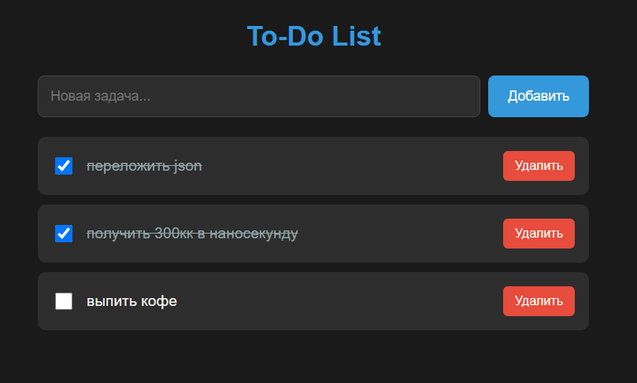

# To-Do List

*Простое API для управления задачами, построенное на FastAPI с асинхронным SQLite.*

## 🌟 Особенности

- Полный CRUD функционал для задач
- Асинхронная работа с SQLite через SQLAlchemy 2.0
- Управление зависимостями через Poetry
- Автоматическая документация API (Swagger/Redoc)

## 🚀 Технологии

- Python 3.9+
- FastAPI
- SQLAlchemy 2.0
- Pydantic v2
- Poetry (для управления зависимостями)
- SQLite (с асинхронным драйвером aiosqlite)

## ⚙️ Запуск приложения

1. Клонируйте репозиторий:
```
git clone https://github.com/L1inkoln/legendary-todo-list.git
cd legendary-todo-list 
```
2. Установите зависимости и запустите: 
```
poetry install --no-root
poetry run uvicorn app.main:app --reload
```

3. Перейдите на localhost для проверки:

- http://127.0.0.1:8000

## 📝Документация API
После запуска сервера доступны:

- Swagger UI: http://localhost:8000/docs
- Redoc: http://localhost:8000/redoc


## 💻 Frontend
*Простой сгенерированый html для тестирования API*


